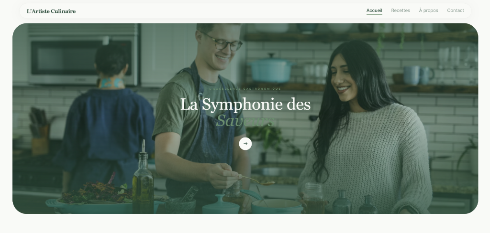
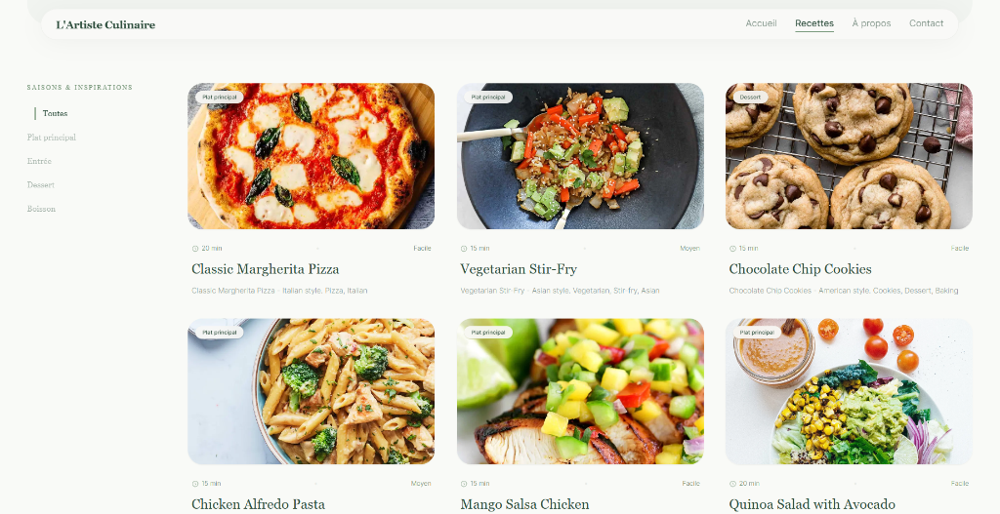
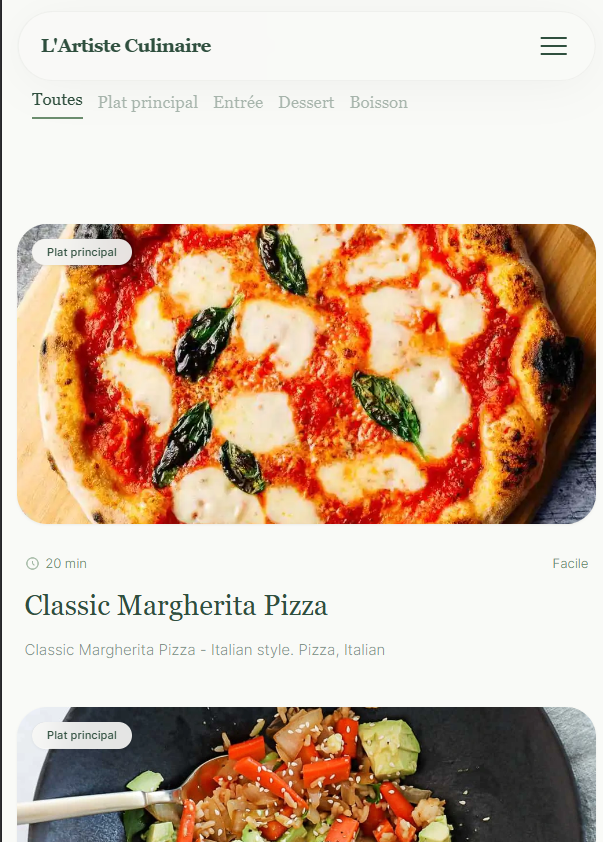

# 🍽️ Le Carnet de Recettes (Recipe App)

A modern, beautifully designed web application for discovering and managing culinary recipes. Built with a focus on elegant UI/UX, smooth animations, and a seamless browsing experience.

## 📸 Screenshots

<div align="center">
  
  <br/>
  <br/>
  
  <br/>
  <br/>
  
</div>

## ✨ Features
- **Categorized Recipes**: Easily filter recipes by `Entrée`, `Plat principal`, `Dessert`, and `Boisson`.
- **Beautiful UI/UX**: Designed with a premium aesthetic, featuring smooth micro-animations and a responsive layout.
- **Dynamic Content**: Uses Redux Toolkit for efficient state management and filtering.
- **Animated Layouts**: Integrated with Framer Motion for elegant scroll reveals and transitions.
- **Search Engine Optimized**: Uses React Helmet Async for dynamic meta tags and SEO management.

## 🛠️ Tech Stack

- **Frontend Framework**: [React 19](https://react.dev/) + [Vite](https://vitejs.dev/)
- **Styling**: [Tailwind CSS](https://tailwindcss.com/) for rapid and highly customizable UI design.
- **State Management**: [Redux Toolkit](https://redux-toolkit.js.org/) for clean, scalable data flow.
- **Routing**: [React Router v7](https://reactrouter.com/) for fast client-side navigation.
- **Animations**: [Framer Motion](https://www.framer.com/motion/) for fluid page transitions.
- **Icons**: [Lucide React](https://lucide.dev/) for crisp, consistent iconography.

## 🚀 Getting Started

### Prerequisites

Make sure you have [Node.js](https://nodejs.org/) installed on your machine.

### Installation

1. Clone the repository:
   ```bash
   git clone https://github.com/yourusername/recipe-app.git
   cd recipe-app
   ```

2. Install the dependencies:
   ```bash
   npm install
   ```

3. Start the development server:
   ```bash
   npm run dev
   ```

4. Open your browser and navigate to the URL provided in your terminal (usually `http://localhost:5173`).

## 📁 Project Structure

- `src/components/` - Reusable UI components (buttons, layout, recipe cards).
- `src/features/` - Redux slices and mock data (e.g., `recipesSlice.js`, `recipesData.json`).
- `src/pages/` - Main views (Home, Recipes, About).
- `src/index.css` - Global Tailwind imports and custom base styles.

## 🤝 Contributing

Contributions, issues, and feature requests are welcome! Feel free to check the issues page if you want to contribute.

## 📝 License

This project is licensed under the MIT License - see the LICENSE file for details.
